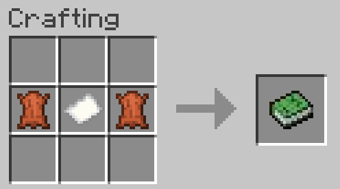
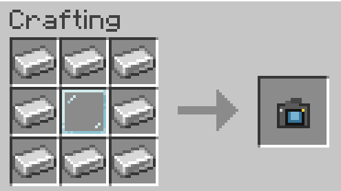

# Class8Mod

You can choose your lnaguage: [English](README.md) | [简体中文](README.zh-cn.md)

## Mod Introdution
This is a mod created by an ordinary high school student during their spare time. 
The content inspiration is mostly derived from class life 
The mod currently only considers being built for Fabric 
if Forgeis going to bemade,it wil probablyhappenwhen creator getsNviDIAGeForce RTX 8060,yeah.

## Main Content

#### Item: Shan's Gift
 
Effect:Consuming grants all positivebuffs for60 seconds 
Acquisition method:You can use Knowledge Book to get a Shan's Gift.

#### Item: Knowledge Book

 
**Effect: use it to get a Shan's Gift**

#### Item: Photo with Shan
 
**Effect: Try to put it on your left hand..**

#### Item: Shan's Polaroid
 
**Effect: use it to get a photo with Shan!** 
**Tips: Please make sure that you have a Shan's gift..** 
**🔴🔴🔴🔴The ID of the item is：Shan_camera**

#### The mod has added an exclushe achieve ment system.
