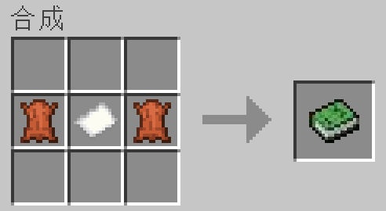
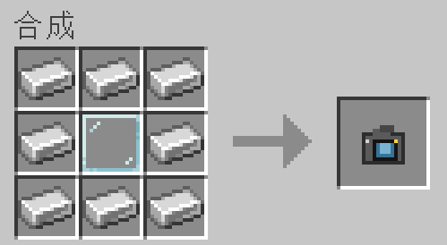

# Class8Mod

请选择你的语言: [English](README.md) | [简体中文](README.zh-cn.md)

## 模组简介

这是一个普通高中生在闲暇时间创作的一款模组。。 
内容灵感大多来源于班级生活 
模组目前只考虑做fabric 
Forge的话大概等creator用上NVIDIA GeForce RTX 8060的时候就会做了吧，嗯对。。。

### 主要内容

#### 物品：鳝的馈赠
 
**作用：食用后获得所有正面buff，持续60s。** 
获得方式：使用知识之书可以获得一个“鳝的馈赠”

#### 物品：知识之书

 
**作用：手持右键可获得物品：“鳝的馈赠”**

#### 物品：与鳝的合照
 
**作用：放在副手会有神奇效果哦~**

#### 物品：鳝的拍立得
 
**作用：手持右键可以和及婷鳝合影哦~** 
**Tips: 请确保您在合照时背包里含有物品“鳝的馈赠”** 
**🔴🔴🔴🔴该物品的ID为：Shan_camera**

#### 模组添加了专属的成就系统